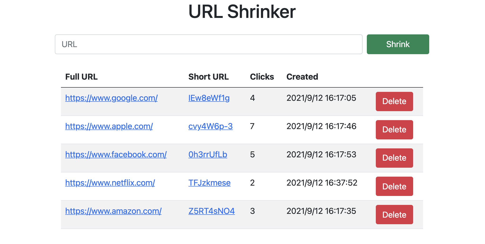

# URL-Shrinker

This project implements url shortening using the following tech stack:

- Back-end
    1. `Node.js`
    2. `Express.js`
    3. `PostgreSQL`

- Front-end
    1. `EJS`
    2. `Bootstrap`




# Usage

## 1. Install all the packages

```bash
npm install
```

## 2. Check if PostgreSQL exists

``` bash
psql -V
```

## 3. Run server

```bash
npm start
```

# Reference

1. [Web Dev Simplified](https://www.youtube.com/watch?v=SLpUKAGnm-g)
2. [node-postgres](https://node-postgres.com/)
